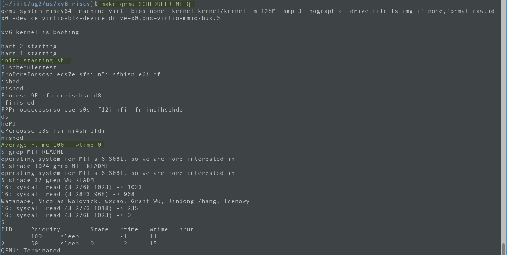

# xv7

## Specification 1 `strace`
- a syscall which takes as args:
    - a `mask`
    - the command to execute, whose syscalls it will trace
- key: expolit the `syscall()` function in `/kernel/syscall.c` which is called whenever a syscall to the kernel is made
- `mask` conveys what all syscalls to look out for by masking its bits
- modified
    - member variables of `struct proc`
    - array of syscalls
    - `syscall()` function itself
    - added a handler function for that syscall
- return value is found in the `a0` register post the execution of the syscall
- args are found in `a0` .. `a2` regsiters before the execution of the syscall

## Specification 2: Task Scheduling
The `scheduler()` function by default is round robin. Made the `scheduler()` function more modular and created `roundrobin()` function out of it. 

### Round robin
- keeps on iterating over the porcess table and returns processes to the `scheduler()` which is are `RUNNABLE`

### First Come First Serve
- implemented a new memeber variable in the `struct proc` member, `ctime` the creation time. The timestamp is put in the `fork()` method i.e. during the birth of the process.
- the `fcfs()` function goes through the process table and picks that process which had the oldest creation time. 
- the pointer to this process is passed on to the `scheduler()` function, which acquires the locks and `swtch`es context

### Priority Based Scheduling
- members added in `struct proc`:
    - `niceness`
    - `static_prio`
    - `dyn_prio`
    - `num_scheduled`
    - `recent_sleep_time`
    - `recent_run_time`
- Static priority is given to be 60 by default, although modifiable by a self implmented syscall `set_priority`
- `niceness` of a process depends on the number of ticks it spends in `SLEEPING` state, and number of ticks it last spent in the `RUNNING` state.
- Dynamic priority is dependent on both niceness and static priority
- on each clock tick the priorities are reassigned to all `NPROC` processes
- the scheduler goes through the process table to pick the one with the highest (numerically lowest) priority
- in case of ties, `num_scheduled` is used
- still in case of ties, creation time is used.

### Multilevel Feedback queue
- has 5 queues
- it is assumed that the processes with higher priorities are IO bound processes so they have lesser CPU times, and hence are allotted less number of CPU ticks for execution.
- a new process is by default given the highest priority queue
```c
int fork(){
    ...
    np-> level = 0;
...
```

- if a process does not relinquish CPU by the allotted number of ticks, it is demoted to a lower priority queue
```c
#ifdef MLFQ
  if(which_dev == 2 && myproc()->change_queue_after <= 0){
      ...
          myproc()->level++;
      yield();
  }
#endif
```

- Ageing: if a process does not get CPU time, it is removed from the original queue and given to a higher priroty queue. 
- the lowest priority queue implicitly works in a round robin manner
- A process can voluntarily give up the CPU on the excuse of a fake/bogus IO request, just before it is force yielded by the clock interrupt; so that it will always be in the top priority queue. The process might by malware itself, i.e. it does no real computation, just hogs the CPU on the highest priority queue, so that other legitimate processes do not get appropriate time and the user experience is degraded.

### procdump
<kbd>Ctrl</kbd> + <kbd>P</kbd> is pressed, it shows the information about the process that are running. Modified `procdump()` to be more informative for MLFQ and PBS

## Schedulertests
```
scheduler   rtime   wtime
rr          99      0
fcfs        100     0
pbs         100     0
mlfq        100     0
```
